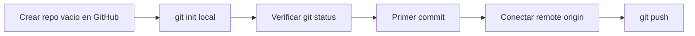
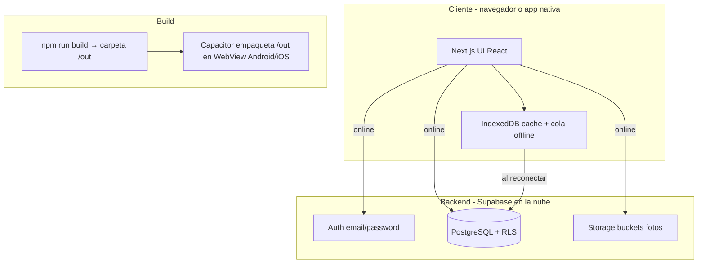
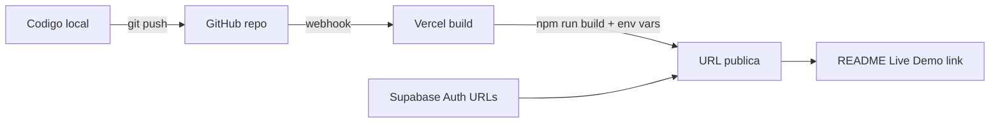

# Vincular GymTrack a GitHub

## Estado actual del proyecto

| Aspecto | Estado |
|---------|--------|
| Git inicializado | **No** — el proyecto aún no es un repositorio |
| Git instalado | Sí (`/usr/bin/git`) |
| GitHub CLI (`gh`) | No instalado (opcional) |
| [`.gitignore`](.gitignore) | Ya excluye lo crítico: `.env`, `.env.local`, `node_modules/`, `.next/`, `out/` |
| Secretos locales | Existe [`.env.local`](.env.local) con claves de Supabase — **no debe subirse** |
| Carpeta Android | [`android/.gitignore`](android/.gitignore) ya excluye builds y assets generados por Capacitor |

---

## Flujo general



---

## Paso 1 — Crear el repositorio en GitHub (web)

1. Entra en [https://github.com/new](https://github.com/new)
2. **Repository name:** por ejemplo `gymtrack` (o el nombre que prefieras)
3. **Visibility:** Public
4. **Importante:** deja **sin marcar** estas opciones:
   - Add a README file
   - Add .gitignore
   - Choose a license
   
   GitHub debe crear un repo **completamente vacío**. Si añades README o .gitignore desde la web, el primer push fallará por historiales distintos.

5. Clic en **Create repository**
6. Copia la URL que GitHub te muestra. Será algo como:
   - HTTPS: `https://github.com/TU_USUARIO/gymtrack.git`
   - SSH: `git@github.com:TU_USUARIO/gymtrack.git`

---

## Paso 2 — Inicializar Git en tu máquina

Abre una terminal en la carpeta del proyecto y ejecuta:

```bash
cd /home/ferzt/Documents/cursepractice
git init
git branch -M main
```

---

## Paso 3 — Verificar qué se va a subir (crítico)

Antes del primer commit, comprueba que los secretos **no** aparecen:

```bash
git status
```

**Debe aparecer** (entre otros): `app/`, `components/`, `lib/`, `android/`, `package.json`, etc.

**NO debe aparecer:**
- `.env.local`
- `node_modules/`
- `.next/`
- `out/`

Si `.env.local` aparece en la lista, **detente** y revisa [`.gitignore`](.gitignore) antes de continuar.

Comprobación extra (opcional pero recomendada):

```bash
git check-ignore -v .env.local node_modules .next out
```

Debería mostrar que esos archivos están ignorados.

### Carpetas opcionales a excluir

Tu [`.gitignore`](.gitignore) no ignora `.claude/` ni `.cursor/`. Si no quieres subir configuración de agentes/IDE, añade antes del commit:

```
.claude/
.cursor/
```

---

## Paso 4 — Primer commit

```bash
git add .
git status   # revisa una última vez la lista de archivos staged
git commit -m "Initial commit: GymTrack fitness PWA with Capacitor"
```

---

## Paso 5 — Conectar con GitHub

Sustituye `TU_USUARIO` y `gymtrack` por tu usuario y nombre de repo:

```bash
git remote add origin https://github.com/TU_USUARIO/gymtrack.git
git remote -v   # confirma que origin apunta bien
```

---

## Paso 6 — Subir el código (`git push`)

```bash
git push -u origin main
```

La primera vez te pedirá autenticación. Elige **una** de las dos opciones:

### Opción A — HTTPS + Personal Access Token (más simple)

1. En GitHub: **Settings → Developer settings → Personal access tokens → Tokens (classic)**
2. **Generate new token (classic)**
3. Marca el scope **`repo`** (acceso completo a repositorios)
4. Copia el token (solo se muestra una vez)
5. Al hacer `git push`:
   - **Username:** tu usuario de GitHub
   - **Password:** pega el **token** (no tu contraseña de GitHub)

Para no escribir el token en cada push, puedes guardarlo en el gestor de credenciales del sistema:

```bash
git config --global credential.helper store
```

(Solo guarda credenciales en tu máquina personal de confianza.)

### Opción B — SSH (sin token en cada push)

1. Genera una clave (si no tienes una):

```bash
ssh-keygen -t ed25519 -C "tu-email@ejemplo.com"
# Enter para ruta por defecto; passphrase opcional
```

2. Copia la clave pública:

```bash
cat ~/.ssh/id_ed25519.pub
```

3. En GitHub: **Settings → SSH and GPG keys → New SSH key** → pega el contenido
4. Prueba la conexión:

```bash
ssh -T git@github.com
```

5. Cambia el remote a SSH y haz push:

```bash
git remote set-url origin git@github.com:TU_USUARIO/gymtrack.git
git push -u origin main
```

| Método | Ventaja | Desventaja |
|--------|---------|------------|
| HTTPS + token | Rápido de configurar | Hay que crear/guardar el token |
| SSH | Push sin pedir credenciales | Configuración inicial de claves |

---

## Paso 7 — Confirmar que todo quedó bien

1. Recarga la página del repo en GitHub — deberías ver todo el código
2. Verifica que **no** aparece `.env.local` en el repositorio
3. En local:

```bash
git status
# debe decir: "Your branch is up to date with 'origin/main'"
```

---

## Flujo diario después de vincular

Cada vez que termines cambios:

```bash
git add .
git commit -m "Descripción breve del cambio"
git push
```

---

## Notas importantes para este proyecto

### Supabase y variables de entorno

Las claves están en [`.env.local`](.env.local) (variables `NEXT_PUBLIC_SUPABASE_*`). Ese archivo está en `.gitignore` y **no debe subirse**. En un repo público, cualquiera que clone el proyecto necesitará crear su propio `.env.local`.

Opcional (recomendado para colaboradores): crear un `.env.example` sin valores reales:

```env
NEXT_PUBLIC_SUPABASE_URL=https://tu-proyecto.supabase.co
NEXT_PUBLIC_SUPABASE_ANON_KEY=tu_anon_key_aqui
```

### Repo público

Con repo **público**, el código fuente es visible. La clave `anon` de Supabase es de diseño pública (va en el cliente), pero protege tu proyecto con **RLS** en Supabase — no subas nunca la `service_role` key.

### Android / Capacitor

- Sube la carpeta `android/` (código nativo del proyecto)
- No subas artefactos de build — ya están cubiertos por [`android/.gitignore`](android/.gitignore)
- Tras clonar en otra máquina: `npm install` → `npm run android`

### GitHub CLI (opcional)

Si quieres crear el repo desde terminal en el futuro:

```bash
# Arch Linux / CachyOS
sudo pacman -S github-cli
gh auth login
gh repo create gymtrack --public --source=. --remote=origin --push
```

No es necesario para esta primera vez si sigues los pasos web + git.

---

## Si algo sale mal

| Error | Solución |
|-------|----------|
| `failed to push some refs` / historiales distintos | Creaste el repo en GitHub **con** README. Borra el repo y créalo vacío, o haz `git pull origin main --allow-unrelated-histories` |
| `Authentication failed` (HTTPS) | Usa un Personal Access Token, no tu contraseña |
| `Permission denied (publickey)` (SSH) | La clave SSH no está en GitHub o el remote no usa URL SSH |
| `.env.local` en el commit | `git rm --cached .env.local`, confirma `.gitignore`, nuevo commit |

---

## Cómo probar la app (para quien la descubra en GitHub)

**Importante:** subir el código a GitHub **no** hace que la app sea usable sola. GymTrack no tiene servidor propio: es una app web estática que habla con **Supabase** (auth + base de datos + fotos). Alguien que quiera probarla necesita **frontend desplegado o ejecutado en local** + **backend Supabase configurado**.

### Cómo funciona por dentro



| Pieza | Qué hace |
|-------|----------|
| **Next.js (static export)** | Genera HTML/JS/CSS estáticos en [`out/`](out/). No hay API routes ni servidor Node en producción. |
| **Supabase Auth** | Registro/login con email y contraseña en [`app/login/page.tsx`](app/login/page.tsx). |
| **Supabase DB** | Tablas definidas en [`migrations/schema.sql`](migrations/schema.sql). Cada usuario solo ve sus datos (RLS). |
| **Supabase Storage** | Buckets `progress-photos` y `exercise-photos` para imágenes. |
| **IndexedDB** | Cache local y cola de operaciones pendientes cuando no hay red ([`lib/offlineQueue.ts`](lib/offlineQueue.ts)). |
| **Capacitor** | Envuelve la web en app Android/iOS; [`capacitor.config.ts`](capacitor.config.ts) apunta a `webDir: "out"`. |

Variables de entorno requeridas (archivo `.env.local`, **no** en GitHub):

```env
NEXT_PUBLIC_SUPABASE_URL=https://xxxxx.supabase.co
NEXT_PUBLIC_SUPABASE_ANON_KEY=eyJ...
```

`@supabase/auth-helpers-nextjs` las lee automáticamente al arrancar la app.

---

### Escenario A — Alguien solo quiere **usar** la app (no programar)

Necesita una **URL pública** o un **APK/IPA** que tú publiques. El repo de GitHub no basta.

**Opción 1 — Web (PWA en el navegador)**

1. Tú haces `npm run build` (genera `out/`).
2. Despliegas `out/` en un hosting estático: Vercel, Netlify, Cloudflare Pages, GitHub Pages, etc.
3. En el despliegue configuras las mismas variables `NEXT_PUBLIC_SUPABASE_*` que en `.env.local`.
4. Compartes la URL. La persona abre `/login`, crea cuenta y usa la app.

Todos los usuarios pueden compartir **tu** proyecto Supabase; los datos están aislados por usuario gracias a RLS.

**Opción 2 — Android**

1. Tú ejecutas `npm run android` (build + `cap sync`).
2. Abres el proyecto en Android Studio, generas APK o instalas en un dispositivo.
3. Compartes el APK o la app en Play Store (futuro).

**Opción 3 — iPhone sin Mac**

1. Con el dev server en tu red local: `npm run dev`.
2. En el iPhone, Safari → `http://TU-IP-LOCAL:3000`.
3. "Añadir a pantalla de inicio" → funciona como PWA con el mismo motor que Capacitor (WKWebView).

---

### Escenario B — Desarrollador que **clona** el repo desde GitHub

Pasos completos para tener la app funcionando en su máquina:

**1. Requisitos**

- Node.js 18+ y npm
- Cuenta gratuita en [supabase.com](https://supabase.com)
- (Opcional Android) Android Studio + JDK
- (Opcional iOS) macOS + Xcode

**2. Clonar e instalar**

```bash
git clone https://github.com/TU_USUARIO/gymtrack.git
cd gymtrack
npm install
```

**3. Crear backend en Supabase**

1. Nuevo proyecto en Supabase Dashboard.
2. **SQL Editor** → pegar y ejecutar [`migrations/schema.sql`](migrations/schema.sql) completo.
3. **Storage** → crear buckets privados:
   - `progress-photos`
   - `exercise-photos`
4. Políticas de storage (por bucket): usuarios autenticados pueden leer/escribir solo en su carpeta `{userId}/...`.
5. **Authentication → Providers** → Email activado. Revisar si "Confirm email" está ON (si sí, hay que confirmar el correo antes de entrar).
6. **Project Settings → API** → copiar **Project URL** y **anon public** key.

**4. Configurar entorno local**

Crear `.env.local` en la raíz:

```env
NEXT_PUBLIC_SUPABASE_URL=https://tu-proyecto.supabase.co
NEXT_PUBLIC_SUPABASE_ANON_KEY=eyJhbGciOi...
```

**5. Arrancar en desarrollo**

```bash
npm run dev
```

Abrir `http://localhost:3000` → `/login` → registrarse → redirige a `/home`.

**6. (Opcional) Build producción / Android**

```bash
npm run build    # genera out/
npm run android  # build + sync Capacitor → abrir android/ en Android Studio
```

---

### Flujo de uso una vez dentro de la app

1. **Login/Signup** — cuenta con email; al registrarse se crea fila en `profiles` (trigger SQL).
2. **Home** — peso diario, agua, fotos de progreso.
3. **Training** — carpetas de rutinas, ejercicios, sesiones activas con series/reps/peso.
4. **Stats** — gráficos e historial desde datos en Supabase.
5. **Settings** — unidades, meta de agua, recordatorios, idioma, cerrar sesión.
6. **Offline** — sin internet puede guardar en cola local; al reconectar sincroniza con Supabase.

---

### Qué conviene añadir al repo para facilitar pruebas

| Archivo | Para qué |
|---------|----------|
| `README.md` | Resumen del proyecto + pasos de setup (escenario B) |
| `.env.example` | Plantilla de variables sin secretos reales |
| URL de demo (opcional) | En el README, enlace a tu despliegue para escenario A |

Sin README ni `.env.example`, quien clone el repo verá código pero no sabrá que necesita Supabase ni cómo configurarlo.

---

## Publicar la versión web en Vercel (desde GitHub)

Objetivo: que en tu repo de GitHub aparezca un enlace tipo **Live Demo → `https://gymtrack.vercel.app`** y cualquier visitante pueda abrir la app en el navegador.

**Prerrequisito:** el código ya debe estar en GitHub (Pasos 1–7 de arriba).

### Por qué Vercel (y no solo GitHub Pages)

GymTrack ya usa `output: "export"` en [`next.config.js`](next.config.js), así que funciona en cualquier hosting estático. Vercel es la opción más simple porque:

- Se conecta directamente al repo de GitHub
- No requiere cambiar `basePath` en Next.js
- Las variables `NEXT_PUBLIC_*` se configuran en su panel (no van en el código)
- Cada `git push` puede redesplegar automáticamente

### Paso 8 — Crear archivos de documentación (antes o después del push)

**`.env.example`** (se sube a GitHub, sin secretos):

```env
NEXT_PUBLIC_SUPABASE_URL=https://tu-proyecto.supabase.co
NEXT_PUBLIC_SUPABASE_ANON_KEY=tu_anon_key_aqui
```

**`README.md`** — incluir al inicio:

```markdown
# GymTrack

App de seguimiento fitness (PWA + Capacitor).

**Live Demo:** https://TU-PROYECTO.vercel.app

## Probar en local
...
```

*(El enlace de demo se completa tras el Paso 9.)*

### Paso 9 — Conectar GitHub con Vercel

1. Entra en [https://vercel.com](https://vercel.com) e inicia sesión con tu cuenta de **GitHub**
2. **Add New → Project**
3. Selecciona el repo `gymtrack` (o el nombre que hayas usado)
4. Vercel detecta Next.js automáticamente. Configuración recomendada:

| Campo | Valor |
|-------|-------|
| Framework Preset | Next.js |
| Build Command | `npm run build` |
| Output Directory | `out` |
| Install Command | `npm install` |

5. **Environment Variables** — añade las mismas que tienes en `.env.local`:

| Name | Value |
|------|-------|
| `NEXT_PUBLIC_SUPABASE_URL` | tu URL de Supabase |
| `NEXT_PUBLIC_SUPABASE_ANON_KEY` | tu anon key |

6. Clic en **Deploy**
7. Tras 1–3 minutos obtienes una URL: `https://gymtrack-xxxxx.vercel.app` (o un dominio personalizado si lo configuras)

### Paso 10 — Configurar Supabase para la URL de producción

Sin esto, login/signup pueden fallar en la demo.

1. Supabase Dashboard → **Authentication → URL Configuration**
2. **Site URL:** `https://TU-PROYECTO.vercel.app`
3. **Redirect URLs** — añadir:
   - `https://TU-PROYECTO.vercel.app/**`
   - `http://localhost:3000/**` (para seguir desarrollando en local)

### Paso 11 — Enlazar la demo desde GitHub

1. Edita el `README.md` con la URL real de Vercel
2. Commit y push:

```bash
git add README.md .env.example
git commit -m "Add README with live demo link and env example"
git push
```

3. En GitHub, el README se renderiza en la página principal del repo con el enlace **Live Demo** visible para todos

Opcional en Vercel: **Settings → Git → Production Branch** = `main` para que cada push a `main` actualice la demo automáticamente.

### Flujo completo (resumen)



### Qué verá alguien que entre desde GitHub

1. Abre tu repo en GitHub
2. Lee el README → clic en **Live Demo**
3. Llega a `/login` en Vercel
4. Crea cuenta o inicia sesión (usa **tu** Supabase; datos aislados por usuario con RLS)
5. Usa Home, Training, Stats, Settings como en local

### Notas

- La **anon key** va en Vercel como variable de entorno, no en el código fuente — eso es correcto para apps cliente Supabase
- **No** subas la `service_role` key a Vercel ni a GitHub
- Si cambias las variables en Vercel, haz **Redeploy** para que el build las incorpore
- Vercel plan gratuito basta para demos personales

### Solución: `Invalid supabaseUrl: Must be a valid HTTP or HTTPS URL`

Este error significa que **Vercel no tenía las variables de entorno durante el build**. El archivo `.env.local` solo existe en tu PC; Vercel **no lo lee** del repo (está en `.gitignore`).

**Pasos en Vercel:**

1. Dashboard → tu proyecto **GymTrack** → **Settings** → **Environment Variables**
2. Añade **exactamente** estas dos (nombres con mayúsculas/minúsculas idénticos):

| Name | Value | Environments |
|------|-------|--------------|
| `NEXT_PUBLIC_SUPABASE_URL` | `https://aufrkbdtaewbaatzfxgv.supabase.co` | Production, Preview, Development (marca las 3) |
| `NEXT_PUBLIC_SUPABASE_ANON_KEY` | tu anon key de Supabase → Settings → API | Production, Preview, Development (marca las 3) |

3. **Save**
4. **Deployments** → último deploy fallido → menú **⋯** → **Redeploy** (obligatorio: un deploy anterior no ve variables añadidas después)

**Errores frecuentes:**

- Nombre mal escrito (`SUPABASE_URL` sin `NEXT_PUBLIC_`)
- URL sin `https://` o con espacio al final
- Variables solo en Preview pero no en **Production**
- Añadir variables pero no hacer **Redeploy**

**Comprobar en Supabase** (copiar desde ahí, no desde un mensaje de chat):

Supabase Dashboard → **Project Settings → API** → **Project URL** y **anon public** key.

Tras un redeploy correcto, el log debe pasar `Generating static pages (9/9)` sin errores y la URL de Vercel debe cargar `/login`.
