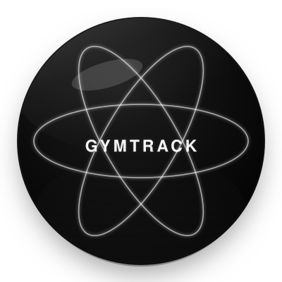
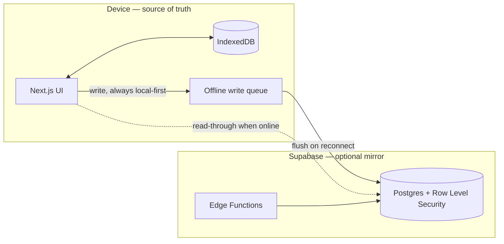

<div align="center">



# GymTrack

### *A hypertrophy lab disguised as a fitness app.*

[](https://nextjs.org)
[](https://www.typescriptlang.org)
[](https://capacitorjs.com)
[](https://supabase.com)
[](#built-local-first)

</div>

---

## ◈ What is this

**GymTrack** is a personal hypertrophy and body-recomposition tracker — training log, nutrition diary, and progress analytics in one app, built for **Android, iOS, and web from a single codebase.**

It exists because the author is, in no particular order: a gym rat, a science nerd, and someone who couldn't find a tracker that treated training data the way a lab treats an experiment. So it got built — RPE, e1RM curves, RP hypertrophy volume landmarks, dropsets, macro-level nutrition breakdowns down to the micronutrient, all wrapped in a UI that looks like an instrument panel because, frankly, your training log *is* an instrument panel. You're the subject and the experimenter at the same time.

> *"The observer effect: your gains only materialize when you track them."*
> — the app, about itself, in the Settings page

## ▲ The thesis

GymTrack sits at the intersection of three things that don't usually share a codebase:

- **Science** — monospace metrics, tabular data, instrument-panel labels, clinical whitespace. Numbers read like lab output, not like a diet app trying to be your friend.
- **Gym** — spring-physics animations, a PR fanfare when you actually break one, a heartbeat-pulse logo, an anatomical heatmap of what you've trained this week.
- **Apple glass** — `backdrop-filter` blur, specular insets, Aqua-gel buttons, the visionOS material language applied to a leg-day log.

That intersection has a name inside the codebase: **Cryo Lab**. It's not a theme, it's the whole design language — every card, chart, and button in the app follows it.

## › What it actually does

<table>
<tr><td width="25%" valign="top">

**Training**

</td><td>

Custom exercise library (1,300+ bundled entries, fully offline) or your own. Routines organized in nested folders. A guided **Active Workout** mode with a rest timer, warmup schemes, and a plate-math calculator that tells you exactly which plates go on the bar. Dropsets with unlimited drops, RPE tracking, kg/lbs per set. Personal records are detected automatically and celebrated with a toast and a fanfare, not buried in a table.

</td></tr>
<tr><td valign="top">

**Nutrition**

</td><td>

Daily macro diary grouped by meal, barcode scanning + Open Food Facts search for 3M+ products, a favorites system that remembers *how* you eat something (100 g reference vs. "the whole can"), full nutrition breakdowns with Nutri-Score/NOVA and %DV vitamins/minerals — and an optional AI meal scanner (bring your own free Gemini key) for anything that isn't barcoded, like a home-cooked plate.

</td></tr>
<tr><td valign="top">

**Stats**

</td><td>

This is where the "science" half earns its keep: estimated one-rep max curves (Epley/Brzycki) per exercise, weekly sets per muscle group plotted against Renaissance Periodization's MEV/MAV/MRV hypertrophy landmarks, a body heatmap of training frequency, rep-range focus (strength vs. hypertrophy vs. endurance split), and a 12-week consistency chart. Not vanity metrics — the numbers a coach would actually ask for.

</td></tr>
<tr><td valign="top">

**Home**

</td><td>

Body weight logging with trend charts, water intake tracking with reminders, and a progress-photo gallery — the boring-but-essential stuff that makes the other three sections mean something over time.

</td></tr>
</table>

## ▼ Built local-first

The app works **100% offline, permanently** — not as a fallback mode, as the primary design. IndexedDB is the source of truth on-device; a Supabase backend is an *optional* cloud mirror you can connect for backup and multi-device sync. There's also a full guest mode with no account at all.



Every write lands in IndexedDB first — instantly, with no network round trip — then gets queued and replayed against Supabase once you're actually online. Lose connection mid-workout, mid-flight, in a basement gym with zero bars: nothing is lost, nothing waits on a spinner.

## ⚙ Under the hood

| Layer | Choice | Why |
|---|---|---|
| Framework | Next.js 16 (Turbopack, static export) | No server runtime needed — ships as static files Capacitor can bundle |
| Language | TypeScript, strict mode | This is a science app; the types don't get to lie either |
| Styling | Tailwind CSS + a custom design-token system | The "Cryo Lab" language — glass cards, Aqua buttons, chart color scale |
| Motion | Framer Motion | Spring physics for the nav pill, PR toasts, page transitions |
| Charts | Recharts | e1RM curves, macro trends, volume landmarks |
| Local storage | IndexedDB via `idb` | The actual database — not a cache |
| Cloud (optional) | Supabase — Postgres, Row Level Security, Edge Functions | Backup/sync, and the one place server-side privilege lives |
| Native shell | Capacitor | One React codebase → Android + iOS, native haptics/notifications/status bar |
| Food data | Open Food Facts API | 3M+ barcoded products, Mexico-first search |
| AI (optional) | Google Gemini, bring-your-own-key | Meal photo → macros, for anything not in a barcode database |

## × Cross-platform, for real

Not "responsive web that also runs in a WebView" — every feature is checked against native constraints before it ships:

| | Android | iOS | Web |
|---|---|---|---|
| Notifications | Web Notification API | `@capacitor/local-notifications` | Web Notification API |
| Haptics | `navigator.vibrate` | `@capacitor/haptics` | — |
| Camera / barcode scan | ✓ | ✓ | ✓ |
| Fully offline | ✓ | ✓ | ✓ |
| Install to home screen | ✓ | ✓ (Add to Home Screen) | ✓ (PWA) |

## ▲ Running it

```bash
npm install
npm run dev       # dev server — covers ~90% of UI work in Chrome DevTools
npm run build     # static export to /out
npm run android   # build + sync into the Android project
npm run ios       # build + sync into the iOS project
```

No test suite by design — this is a solo, local-first project where the IndexedDB/Supabase parity is verified by hand against real devices. Lint (`npm run lint`) is kept at zero errors.

## ◈ Credits

```
ARCHITECT     Ferzt360
STATE         Collapsed ✓
CAT STATUS    Alive (you opened it)
THEOREM       Schrödinger's Gym
```

Built solo, for personal use first — shared because a tracker this specific might be useful to someone else who thinks a leg workout deserves the same rigor as a lab notebook.
